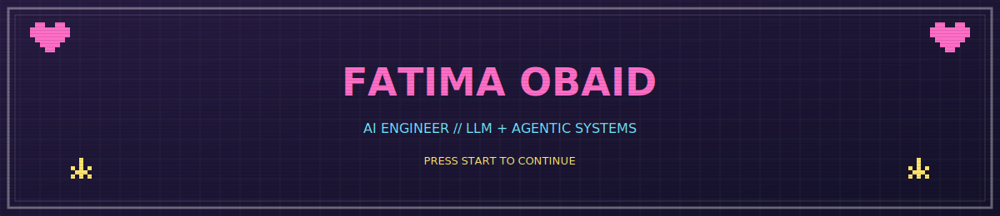
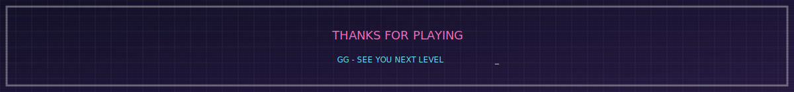

<div align="center">



</div>

<br>

### 🕹️ player info

hi, i'm an AI graduate (FAST-NUCES 🎓) who builds things that actually *think* — multi-agent systems, RAG pipelines, and voice AI. currently grinding through AI/ML job applications while side-questing on new agentic projects.

```
CLASS      : AI Engineer
FOCUS      : LLM + Agentic Systems
CURRENTLY  : building multi-agent HR automation + a RAG voice agent
LEARNING   : agentic workflow design (LangGraph, n8n)
CONTACT    : fatimaobaid267@gmail.com
LINKEDIN   : linkedin.com/in/fatima-obaid
```

<br>

### 🎒 inventory

<p align="left">
  
  
  
  
  
  
  
  
</p>

<br>

### 🎮 level select — featured projects

<table>
<tr>
<td width="50%" valign="top">

**🌸 LEVEL 1 — [HRFlux](https://github.com/ffatimaobaid/hrflux)**
multi-agent HR automation — LeaveBot, PolicyBot, DocuBot & EscalationBot working together via LangGraph, with hybrid RAG (ChromaDB + Groq Llama-3.3-70b) and a React admin portal.

</td>
<td width="50%" valign="top">

**🚗 LEVEL 2 — [Genesis Voice Agent](https://github.com/ffatimaobaid/genesis-voice-agent)**
a voice-first RAG assistant for car listings — Playwright scraping, ChromaDB retrieval, Whisper speech-to-text, Groq generation, ElevenLabs voice output.

</td>
</tr>
<tr>
<td width="50%" valign="top">

**🎭 LEVEL 3 — Real-Time Emotion Recognition**
a CNN trained on FER-2013 that reads facial expressions live through your webcam, served with Flask.

</td>
<td width="50%" valign="top">

**📖 LEVEL 4 — Multilingual Story-to-Audio**
turns written stories into expressive narrated audio in Urdu, Roman Urdu & English using an emotion-aware TTS pipeline.

</td>
</tr>
</table>

<br>

<div align="center">

</div>
